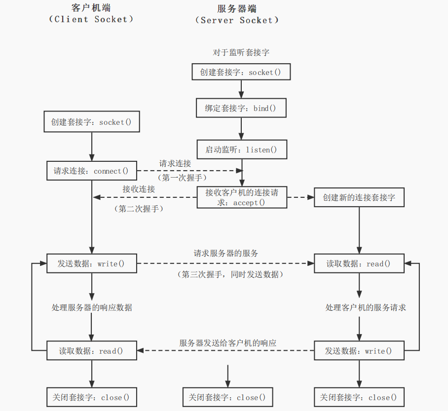

**V1版本是响应多线程服务的socket编程的MVP(minimum viable product最小可行产品)代码示例，需要先拥有以下基础概念**：

1. 网络请求/响应服务是以client-server交互模式来编程的
2. 对linux系统调用，socket编程的基本理解
> 由于APUE涉及概念繁多，局部知识可以参考该博主的博文[linux 系统编程](https://kisugitakumi.net/2022/11/20/Linux%E7%B3%BB%E7%BB%9F%E7%BC%96%E7%A8%8B%E5%AD%A6%E4%B9%A0%E7%AC%94%E8%AE%B0/#11-%E7%BD%91%E7%BB%9C%E5%A5%97%E6%8E%A5%E5%AD%97) （预测阅读时间：几小时）

3. 网络协议的基本理解，代码由于在本地运行，所以使用局域网地址和指定端口 （上文链接有介绍）
> keyword: TCP流式与UDP报式，IP地址划分，网络端口，linux常用网络命令：ifconfig，ss
4. 文件描述符fd
> 什么是文件描述符，与进程和线程对应的关系是什么，fd的生命周期，fd的继承（父子进程），fd的共享（多线程）
5. 线程和进程的区别
> 创建线程后使用detach的原因
